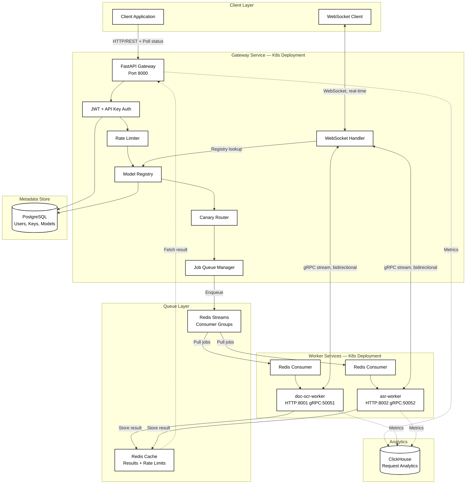

# ModelMesh — Multi-Model Inference Gateway

A horizontally scalable ML serving platform demonstrating registry-driven architecture, async job queues, real-time streaming, and Kubernetes orchestration.

**Status**: Phases 1-4 Complete ║ Phase 5 Partial (70%)

📖 **[Setup Guide](SETUP.md)** | 📁 **[Documentation](docs/)**

---

## What is ModelMesh?

ModelMesh is an inference gateway built to solve a core problem in ML serving: **how do you add, version, and route between multiple models without constantly redeploying your gateway code?**

Most inference servers hardcode model names and endpoints. Adding a new model = code change + deployment. Switching protocols (HTTP → gRPC) = refactor. Canary rollouts = complex Kubernetes replica manipulation.

ModelMesh flips this: **all routing is data-driven**. Models live in a PostgreSQL registry. Adding a model is a `POST /v1/models` API call. Protocol switching is an `UPDATE` query. Canary rollouts are percentage fields in the database.

This project implements a complete, working system demonstrating this pattern across 5 progressive phases.

---

## Why This Architecture Matters

### The Registry Pattern

Traditional approach:

```python
if model_name == "doc-ocr":
    return http.post("http://ocr-worker:8001/infer", data)
elif model_name == "asr":
    return http.post("http://asr-worker:8002/infer", data)
```

Every new model requires code changes. Switching protocols requires refactoring. Versioning requires complex routing logic.

ModelMesh approach:

```python
model = await registry.get_model(db, model_name)  # DB lookup
return await route(model.endpoint, model.protocol, data)  # Generic routing
```

Adding a model:

```bash
POST /v1/models {"name": "new-model", "protocol": "grpc", "endpoint": "..."}
```

Switching protocols:

```sql
UPDATE models SET protocol = 'grpc', endpoint = 'worker:50051' WHERE name = 'doc-ocr';
```

Zero code changes. Zero deployments. Just data.

---

## System Architecture



---

## Key Design Decisions

### 1. Registry-Driven Routing

**Problem**: Hardcoded model names force redeployments for every model addition.

**Solution**: `models` table with name, version, worker_name, protocol, endpoint. Gateway resolves all routing via DB lookups.

**Payoff**:

- Phase 3: HTTP → gRPC switch = `PATCH /v1/models/{id}`, not a code deploy
- Phase 5: Canary rollout = INSERT new version row + set `canary_percent` field

### 2. Async Queue Architecture

**Problem**: Synchronous inference blocks gateway capacity. Slow requests stall everything.

**Solution**: Gateway enqueues jobs to Redis Streams, returns job_id immediately. Workers pull from queue at their own pace.

**Payoff**:

- Gateway never blocks
- Workers scale independently (3 replicas = 3x throughput)
- Automatic retries + DLQ for failed jobs
- Idempotent processing (worker crash = safe redelivery)

**Trade-off**: Clients poll `/v1/jobs/{id}` instead of instant response (Phase 3 adds WebSockets to fix this)

### 3. Multi-Service Containers

**Problem**: Splitting HTTP + gRPC + Redis consumer into separate pods = 3x memory (model weights loaded 3 times).

**Solution**: Single container runs all 3 services concurrently. Entrypoint script backgrounds HTTP and gRPC servers, runs consumer in foreground.

**Payoff**: 1.5GB model weights loaded once, not 3 times. Container death = consumer crash (intentional).

### 4. Protocol Abstraction

```python
async def route_request(endpoint: str, protocol: str, payload: bytes):
    if protocol == "http":
        return await http_client.post(endpoint, data=payload)
    elif protocol == "grpc":
        return await grpc_client.call(endpoint, payload)
```

Adding gRPC in Phase 3 = extending this function, not rewriting endpoints. All existing HTTP paths kept working.

---

## What Was Built

### Phase 1: Core Gateway ([docs](docs/Phase1-Core-Gateway.md))

- Dynamic model registry (PostgreSQL)
- JWT auth + API key management
- Redis rate limiting (sliding window)
- Request logging with latency tracking
- Two workers: EasyOCR (doc-ocr) + Whisper (asr)

### Phase 2: Async Job Queue ([docs](docs/Phase2-Async-Job-Queue.md))

- Redis Streams job queue with consumer groups
- Kafka alternative implementation (KRaft mode)
- Exponential backoff retry logic (2s, 4s, 8s)
- Dead-letter queue for failed jobs
- Consumer lag monitoring (XLEN, XPENDING)
- Horizontal worker scaling

### Phase 3: Streaming + gRPC ([docs](docs/Phase3-Streaming-gRPC-WebSockets.md))

- WebSocket endpoint for real-time streaming
- gRPC with Protocol Buffers for internal communication
- Bidirectional streaming RPC (PredictStream)
- Protocol abstraction in registry (HTTP ↔ gRPC switchable)
- Multi-service containers (HTTP + gRPC + Redis consumer)

### Phase 4: Kubernetes ([docs](docs/Phase4-Kubernetes-Deployment.md))

- Namespace isolation (`modelmesh`)
- StatefulSet for Postgres with PersistentVolume
- Deployments for Gateway, Workers, Redis
- ConfigMaps for Postgres init SQL
- Secrets for JWT + DB passwords
- Resource requests/limits + health probes
- Tested on minikube (2 CPU / 4GB RAM)

### Phase 5: Observability + Canary ([docs](docs/Phase5-Observability-Canary.md))

**Implemented (70%)**:

- ClickHouse request analytics (columnar storage, MergeTree engine)
- Fire-and-forget metric logging (never blocks inference)
- Canary routing logic (`canary_percent` field in registry)
- Version pinning support (`?version=v1` bypasses canary)
- Prometheus metrics instrumentation (Counter, Histogram with labels)
- `/metrics` endpoints exposed

**Not Deployed**:

- Prometheus + Grafana pods (scoped out due to minikube RAM constraints: 2 CPU / 4GB)
- Instrumentation code is complete; just need to `helm install` in production

---

## Tech Stack

| Component         | Technology                          | Purpose                                |
| ----------------- | ----------------------------------- | -------------------------------------- |
| **Gateway**       | FastAPI (Python 3.11+)              | HTTP/WebSocket API server              |
| **Workers**       | EasyOCR, Whisper                    | Pretrained PyTorch models              |
| **Queue**         | Redis Streams, Kafka                | Async job distribution                 |
| **Metadata**      | PostgreSQL                          | Users, keys, models, requests          |
| **Analytics**     | ClickHouse                          | Request metrics, per-version breakdown |
| **Protocols**     | HTTP/REST, WebSocket, gRPC/Protobuf | Client and internal communication      |
| **Orchestration** | Docker Compose, Kubernetes          | Dev and local deployment               |

---

## What This Demonstrates

**Architecture Patterns**:

- Registry-driven routing (eliminates hardcoded dependencies)
- Async queue decoupling (gateway never blocks)
- Protocol abstraction (HTTP/gRPC switchable via data)
- Multi-service containers (memory-efficient deployment)
- Canary deployments without K8s complexity

**Engineering Skills**:

- API design (FastAPI, REST, WebSocket, gRPC)
- Queue systems (Redis Streams, Kafka, consumer groups)
- Database design (transactional + analytical workloads)
- Kubernetes manifests (StatefulSets, PVCs, Services)
- Observability (ClickHouse analytics, Prometheus metrics)

**System Thinking**:

- Trade-offs documented (async vs sync, HTTP vs gRPC, Redis vs Kafka)
- Failure modes handled (retry logic, DLQ, idempotency)
- Honest scope (production gaps clearly stated)

---

## Limitations & Scope

**What this is:**

- Development/learning project demonstrating ML serving architecture
- Tested on Docker Compose and local minikube only
- Built to showcase registry-driven design patterns

**What this is NOT:**

- Production-ready (secrets committed to git, no TLS, no external monitoring)
- Tested at scale (minikube: 2 CPU / 4GB RAM)
- Multi-tenant ready (basic auth, no isolation)

**Known gaps:**

- Kubernetes secrets committed to repo (NOT production-safe)
- Prometheus + Grafana instrumented but not deployed (resource constraints)
- No Ingress controller or TLS
- No CI/CD pipeline
- Tested with small payloads only

---

## Project Structure

```
modelmesh/
├── gateway/                 # FastAPI gateway + registry
│   ├── main.py
│   ├── registry.py
│   ├── job_queue.py
│   ├── grpc_client.py
│   └── metrics.py
├── workers/                 # Model workers
│   ├── doc_ocr/            # EasyOCR (HTTP + gRPC + consumer)
│   └── asr/                # Whisper (HTTP + gRPC + consumer)
├── k8s/                    # Kubernetes manifests
│   ├── gateway/
│   ├── workers/
│   ├── postgres/
│   ├── redis/
│   └── clickhouse/
├── docs/                   # Phase documentation
│   ├── Phase1-Core-Gateway.md
│   ├── Phase2-Async-Job-Queue.md
│   ├── Phase3-Streaming-gRPC-WebSockets.md
│   ├── Phase4-Kubernetes-Deployment.md
│   └── Phase5-Observability-Canary.md
├── inference.proto         # gRPC contract
├── docker-compose.yml
├── SETUP.md               # Setup instructions
└── README.md              # This file
```

---

## Quick Start

```bash
# Docker Compose
docker compose up --build

# Kubernetes (minikube)
minikube start --cpus=2 --memory=4096
eval $(minikube docker-env)
# ... build images and kubectl apply

# See SETUP.md for detailed instructions
```

**Full setup guide**: [SETUP.md](SETUP.md)

---

## Documentation

| Document                                            | Description                                                   |
| --------------------------------------------------- | ------------------------------------------------------------- |
| [SETUP.md](SETUP.md)                                | Complete setup instructions for Docker Compose and Kubernetes |
| [Phase 1](docs/Phase1-Core-Gateway.md)              | Core gateway + model registry                                 |
| [Phase 2](docs/Phase2-Async-Job-Queue.md)           | Async job queues (Redis Streams + Kafka)                      |
| [Phase 3](docs/Phase3-Streaming-gRPC-WebSockets.md) | WebSockets + gRPC streaming                                   |
| [Phase 4](docs/Phase4-Kubernetes-Deployment.md)     | Kubernetes deployment on minikube                             |
| [Phase 5](docs/Phase5-Observability-Canary.md)      | ClickHouse analytics + canary routing                         |

